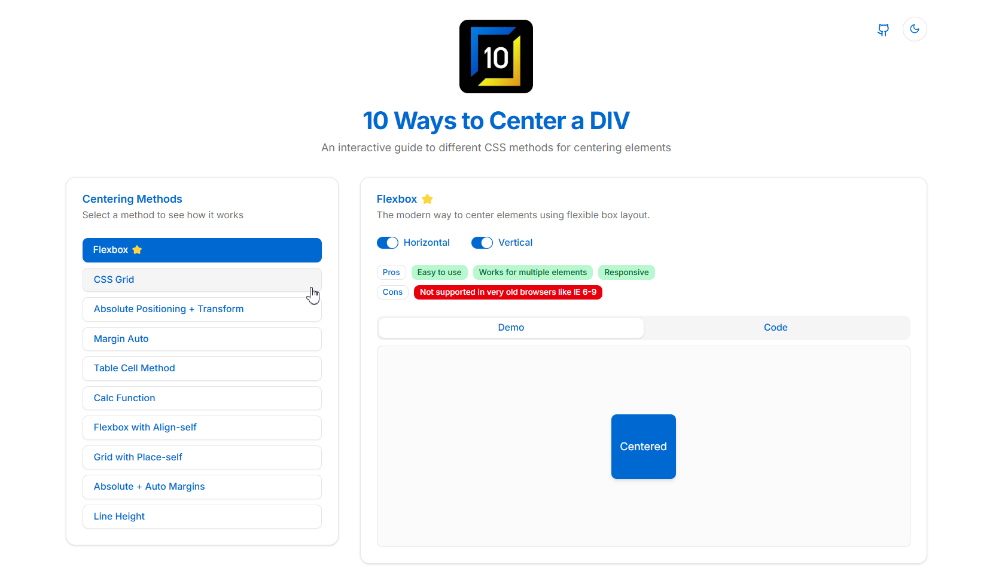
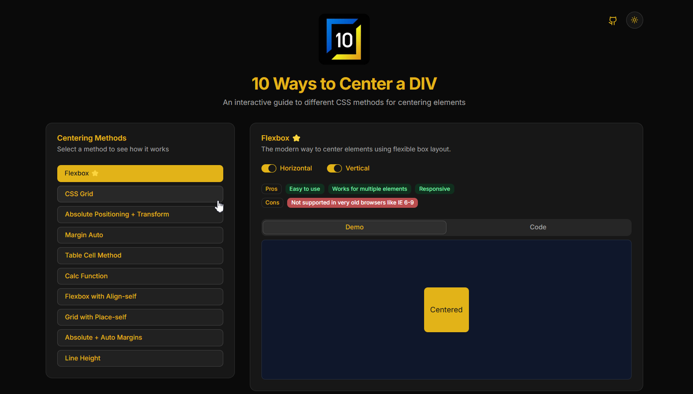
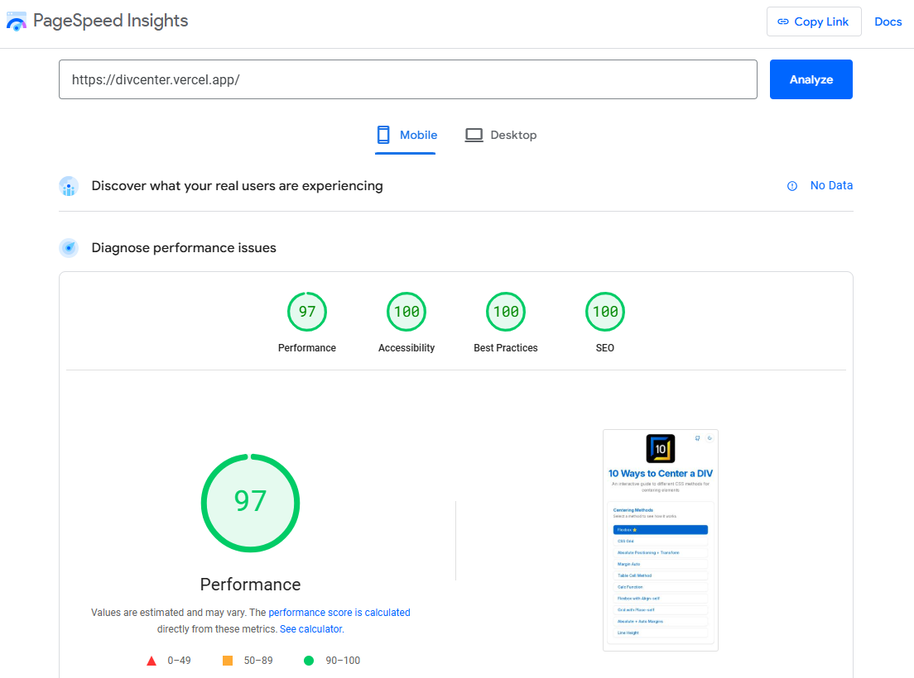
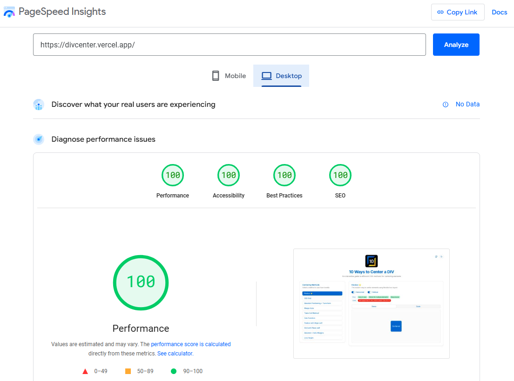

# 10 Ways to Center a DIV

An interactive educational web application demonstrating 10 different CSS methods to center elements. This project provides a visual and code-based guide to help developers understand various centering techniques in CSS.

## 📀 Features

- **Interactive Demonstrations**: Visual examples of 10 different centering methods
- **Direction Control**: Toggle between horizontal, vertical, or both centering directions
- **Code Snippets**: View and copy the CSS code for each method
- **Pros & Cons**: Each method includes advantages and disadvantages
- **Responsive Design**: Works on desktop and mobile devices
- **Smooth Animations**: Visual transitions between different methods
- **Modern UI**: Clean, minimalist interface with Tailwind CSS and shadcn/ui
- **Dark/Light Theme**: Toggle between custom blue-themed light mode and gold-accented dark mode
- **Syntax Highlighting**: CSS code blocks with proper syntax highlighting for better readability

## 🧰 Technologies Used

- **Next.js**: React framework with App Router
- **TypeScript**: Type-safe JavaScript
- **Tailwind CSS**: Utility-first CSS framework
- **Framer Motion**: Animation library
- **shadcn/ui**: High-quality UI components

## 📋 Centering Methods Included

1. **Flexbox**: Modern approach using flexible box layout
2. **CSS Grid**: Using Grid's powerful alignment capabilities
3. **Absolute + Transform**: Precise positioning with transforms
4. **Margin Auto**: Classic approach with automatic margins
5. **Table Cell**: Using CSS table display properties
6. **Calc Function**: Mathematical calculations for positioning
7. **Flexbox with Align-self**: Individual item alignment in flexbox
8. **Grid with Place-self**: Individual item alignment in grid
9. **Absolute + Auto Margins**: Combining absolute positioning with margins
10. **Line Height**: Using line-height for vertical centering of single-line text.

## 🚀 PageSpeed Insights

 

✅ Mobile: 97/ 100 / 100 / 100

✅ Desktop: 100 / 100 / 100 / 100